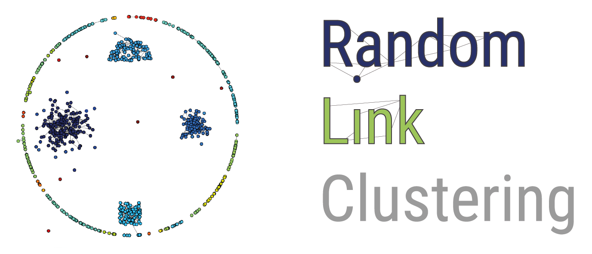
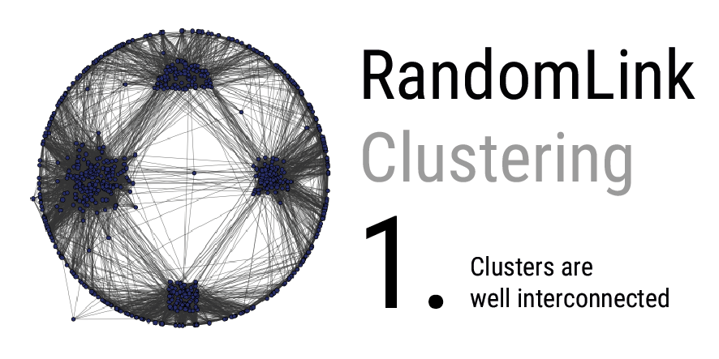

# RandomLink
**Avoiding Linkage-Effects by employing Random Effects for Clustering**
| [Link to Paper](http://www.dexa.org/dexa2020)

>**Abstract.** We present here a new parameter-free clustering algorithm
that does not impose any assumptions on the data. Based solely on the
premise that close data points are more likely to be in the same cluster,
it can autonomously create clusters. Neither the number of clusters nor
their shape has to be known. The algorithm is similar to SingleLink in
that it connects clusters depending on the distances between data points,
but while SingleLink is deterministic, RandomLink makes use of random
effects. They help RandomLink overcome the SingleLink-effect (or chain-
effect) from which SingleLink suffers as it always connects the closest
data points. RandomLink is likely to connect close data points but is not
forced to, thus, it can sever chains between clusters. We explain in more
detail how this negates the SingleLink-effect and how the use of random
effects helps overcome the stiffness of parameters for different distance-
based algorithms. We show that the algorithm principle is sound by
testing it on different data sets and comparing it with standard clustering
algorithms, focusing especially on hierarchical clustering methods.

## Repository Structure

The repository is organised as the following. Data sets, labels and results from the paper are in the respective
directories. The figure directory just contains the images used for this README.
The code is in split into the `random_link.py` module that contains the clustering algorithm, some helper functions and
a main function for calling the algorithm on some data and the `disjoint-set.py` module that contains the datastructure
which enables a fast online connected components analysis.  

    ├── data | (datasets used for evaluation)
    │   ├── arrhythmia.txt
    │   ├── ...
    │   └── yeast.txt
    ├── labels | (computed cluster labels from other algorithms)
    │   ├── arrhythmia.txt_ALGORITHM_labels.csv
    │   ├── ...
    │   └── yeast.txt_ALGORITHM_labels.csv
    ├── results
    │   ├── comparison_cluster_results.csv | (table with computed NMIs of the cluster labels)
    │   └── random_link_results.csv | (table with RandomLink cluster labels and NMIs of 100 runs for each dataset)
    ├── randomlink | (source folder)
    │   ├── disjoint_set.py
    │   └── random_link.py
    ├── requirements.txt
    └── README.md

## Dependencies

The code is written for **Python 3.6** and uses the following dependencies:

    numpy~=1.18.1
    pandas~=1.0.3
    scipy~=1.4.1
    scikit-learn~=0.22.1

run `python pip install -r requirements.txt` to install the necessary packages listed in `requirements.txt`

## Getting Started

simply run `python random_link.py` to cluster one of the datasets that is provided. The code outputs the
 **Normalized Mutual Information** (NMI) of the clustering result. If you need the cluster labels you can adapt the
 last lines of the main function to save the labels.

### Clustering your own dataset

Adapt the path in [`random_link.py` Line 308](https://github.com/53RT/RandomLink/blob/master/random_link#L308)
to point on your dataset to cluster it. Make sure your dataset uses the same formatting as the example datasets do.

## Citing this Work

If you use our work, please cite our paper:

    @inproceedings{cs6415,
              author = {Gert Sluiter and Benjamin Schelling and Claudia Plant},
               month = {September},
           booktitle = {31st International Conference on Database and Expert Systems Applications},
               title = {RandomLink - Avoiding Linkage-Effects by employing Random Effects for Clustering},
                year = {2020},
                 url = {http://eprints.cs.univie.ac.at/6415/}
    }
